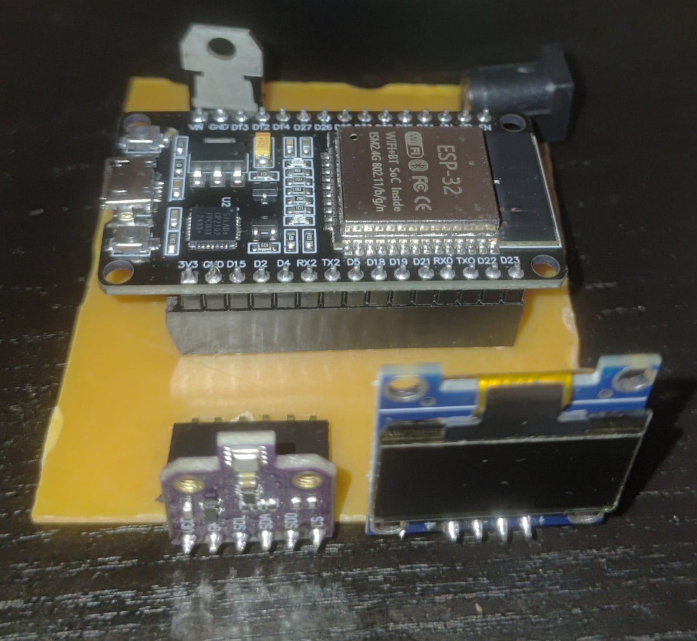

# 🌳 𝓔𝓷𝓿𝓲𝓻𝓸𝑺𝒆𝒏𝒔𝒆

### Smart IoT Weather & Air Quality Monitoring System

*Turning real-time environmental data into meaningful insights.*

 

# 🌿 Overview

**EnviroSense** is a smart IoT platform that transforms environmental sensing into an interactive monitoring experience. Built around the ESP32 and the BME680 environmental sensor, the system continuously measures temperature, humidity, atmospheric pressure, and air quality before securely transmitting the data to the cloud.

Rather than limiting sensor readings to a serial monitor, EnviroSense combines cloud connectivity, a responsive web dashboard, local OLED visualization, intelligent email alerts, and power-efficient firmware to create a complete end-to-end monitoring solution. The project demonstrates how embedded systems, cloud communication, and modern web technologies can seamlessly work together to make environmental information accessible from anywhere.

---

# 🌐 Live Dashboard

Experience the deployed dashboard here:

### **https://enviro-sense-delta.vercel.app**

> *Live readings are available whenever the ESP32 device is connected and publishing data.*

---

## 📑 Table of Contents

- [Overview](#-overview)
- [Live Dashboard](#-live-dashboard)
- [About the Project](#-about-the-project)
- [Key Features](#-key-features)
- [How EnviroSense Works](#-how-envirosense-works)
- [Technologies Used](#-technologies-used)
- [Hardware](#-hardware)
- [PCB Design](#-pcb-design)
- [Challenges](#-challenges)
- [What We Learned](#-what-we-learned)
- [Future Scope](#-future-scope)
- [Contributors](#-contributors)

---

# 📖 About the Project

Environmental conditions constantly change, yet understanding those changes often requires specialised equipment or complex monitoring systems. EnviroSense was developed to bridge that gap by providing a compact, affordable, and intelligent platform capable of collecting, transmitting, and visualising environmental data in real time.

At its core, the ESP32 communicates with the BME680 sensor to measure temperature, humidity, atmospheric pressure, and gas resistance. The collected readings are published to Adafruit IO using the MQTT protocol, allowing them to be securely accessed through a custom-built web dashboard from virtually anywhere.

To make the system practical beyond simple monitoring, EnviroSense also incorporates an OLED display that provides live sensor readings directly on the device, enabling users nearby to instantly view environmental conditions without opening the dashboard. An integrated email alert system further enhances usability by automatically notifying users whenever predefined environmental thresholds are exceeded, ensuring that important changes never go unnoticed.

Together, these components transform EnviroSense from a simple sensor project into a complete IoT monitoring solution that combines embedded systems, cloud services, and web technologies into one cohesive platform.

---

## ⚡ Key Features

- Real-time environmental monitoring (Temperature, Humidity, Pressure & Air Quality)
- MQTT-based cloud communication
- Adafruit IO cloud integration
- Interactive web dashboard
- Automated email alert system
- Power optimization using Deep Sleep
- OLED display for local monitoring
- Responsive interface for desktop and mobile
- Secure cloud-based data visualization

---

# 🧠 How EnviroSense Works

EnviroSense follows a complete IoT workflow where sensing, communication, visualization, and notification work together to provide continuous environmental monitoring.

The BME680 sensor periodically measures temperature, humidity, atmospheric pressure, and gas resistance. These readings are collected by the ESP32, where they are processed, formatted, and prepared for transmission. Once connected to Wi-Fi, the ESP32 publishes the latest environmental data to Adafruit IO using the lightweight MQTT protocol, making the information available over the internet in real time.

The custom-built web dashboard retrieves these values from the cloud and updates the visual interface automatically. Interactive gauges and graphs allow users to monitor changing environmental conditions from any device without requiring direct access to the hardware.

For users who are physically near the device, the integrated OLED display provides an immediate view of the latest sensor readings. This enables quick local monitoring even when internet access or the dashboard is unavailable, making the system useful in both remote and on-site environments.

EnviroSense also includes an automated email notification system designed to improve responsiveness. Whenever monitored parameters exceed predefined threshold values, the system automatically triggers an email alert, allowing users to take timely action without continuously checking the dashboard. This makes the platform suitable for applications where immediate awareness of environmental changes is important.

To improve efficiency and reduce unnecessary power consumption, the firmware incorporates power optimization techniques such as **Deep Sleep mode**. Instead of remaining active continuously, the ESP32 periodically wakes up, collects sensor readings, transmits the data to the cloud, updates the OLED display, checks alert conditions, and then returns to a low-power sleep state. This significantly reduces energy usage and extends battery life, making EnviroSense better suited for long-term deployments in remote or battery-powered environments.

The overall workflow can be summarized as follows:

EnviroSense delivers a reliable environmental monitoring solution that remains practical for both everyday use and long-term IoT deployments.

---

# 🛠 Technologies Used

### Hardware

- ESP32 Development Board
- BME680 Environmental Sensor
- OLED Display

### Software & Cloud

- Arduino IDE
- HTML
- CSS
- JavaScript
- MQTT
- Adafruit IO
- Vercel

---

# 🔌 Hardware

The hardware combines the ESP32 with the BME680 environmental sensor to continuously monitor atmospheric conditions. An integrated OLED display allows nearby users to view live sensor readings directly from the device, while the ESP32 manages wireless communication, cloud connectivity, email notifications, and power-efficient operation within a compact embedded system.

---

# 📐 PCB Design

To improve reliability and move beyond a breadboard prototype, a dedicated PCB was designed for the system. The custom PCB provides cleaner connections, better durability, and a more compact implementation, making the overall design easier to assemble, maintain, and deploy.

 

---

# 🚧 Challenges

Developing EnviroSense involved much more than interfacing a sensor. Integrating reliable cloud communication, designing an intuitive dashboard, implementing automated notifications, optimizing power consumption, and ensuring smooth interaction between hardware and software required continuous testing, debugging, and refinement. Overcoming these challenges helped transform the project into a stable and practical IoT solution.

---

# 🎓 What We Learned

EnviroSense provided valuable experience in designing complete IoT systems that combine embedded hardware with cloud-based applications. Throughout the project, we strengthened our understanding of sensor interfacing, MQTT communication, responsive web development, cloud deployment, PCB design, power optimization, debugging, and collaborative software development while learning how independently developed components can be integrated into a single, scalable solution.

---

# 🚀 Future Scope

Although EnviroSense already provides a comprehensive environmental monitoring solution, several enhancements can further extend its capabilities:

- Machine learning-based environmental prediction
- Mobile application support
- Historical data analytics
- Multi-device monitoring
- User authentication
- Additional environmental sensors
- Customizable alert thresholds

---

# 👨‍💻 Contributors

- **Rajnarayan Hazra**
- **Riya Pailwan**
- **Harsh Patange**

---

# ⭐ Support

If you found this project interesting, consider giving the repository a **Star ⭐**. Your support motivates us to continue improving EnviroSense and building more innovative open-source projects.

---

Made with ❤️ using ESP32, IoT, and Web Technologies.

